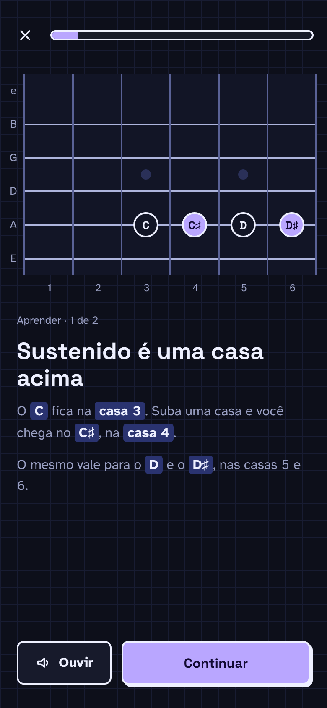

# F2 · Lições de Notes

## Resumo

> Pendente: confirmar comportamento vigente; material descreve produto proposto.

## Rotas/Telas

## 07 · Lição · Aprender

Tema escuro · Explicação 1 de 2 · pág. 9



**Objetivo**

- Primeira fase da lição ("Veja"): mostrar o truque no braço antes de qualquer pergunta.

**Elementos**

- Topo fixo: botão "✕" (44 px, sair) e barra de progresso da sessão (12 px) em 10%.
- Braço com janela de 6 casas (1 a 6), 6 cordas de 40 px com rótulos "e B G D A E": notas de referência "C" e "D" (círculo com contorno) e notas da lição "C♯" e "D♯" (círculo roxo) na corda A.
- Rótulo "Aprender · 1 de 2" (13 px, cinza).
- Título "Sustenido é uma casa acima" (28 px).
- Texto (16 px) com marca-texto nas notas e casas: "O C fica na casa 3. Suba uma casa e você chega no C♯, na casa 4." e "O mesmo vale para o D e o D♯, nas casas 5 e 6."
- Botão secundário "Ouvir" (ícone de alto-falante) e botão primário "Continuar".

**Estado e comportamento**

- "Ouvir" toca as notas destacadas em sequência.
- "Continuar" vai para a explicação 2 de 2 e depois para 08.
- "✕" pede confirmação para sair; Cancelar retoma a lição e Sair a abandona sem salvar.

## 12 · Fim da lição

Tema escuro · 2 de 3 estrelas · pág. 16


**Objetivo**

- Celebrar a lição concluída e mostrar no braço as notas novas.

**Elementos**

- Rótulo "Novas no seu braço" e braço das casas 1 a 9 com as notas aprendidas em verde na corda A: "A♯", "C♯", "D♯", "F♯".
- Três estrelas de 48 px: duas preenchidas em amarelo, a terceira só com contorno tracejado.
- Título "Lição concluída" (32 px) e "90% de acerto de primeira" (16 px).
- Botão primário "Continuar" no rodapé.

**Estado e comportamento**

- Estrelas: 3 com 95% ou mais de acerto de primeira, 2 com 80% ou mais, 1 abaixo disso.
- No M2, "Continuar" volta à lista ou seletor de lições; integração com a sessão diária fica para M4.

## Estados e ações

## 3. Fluxo de uma lição

```
LEARN (n passos) → PRACTICE (com apoio) → YOUR TURN (sem ajuda) → Lesson complete → seletor de lições (M2)
```
Em todas as telas: barra de progresso no topo e **X** para sair ✅

### 3.1 LEARN ✅
- O braço mostra só as notas-alvo, com a corda-alvo destacada.
- Cada passo ensina um **truque** diferente. Exemplos da lição "C, B, A na corda G":
  - *Shape da corda vizinha*: A, B, C da corda A (trastes 0, 2, 3) reaparecem na corda G nos trastes 2, 4, 5. Uma linha diagonal liga os dois.
  - *Contagem*: G solta → A (tom) → B (tom) → C (semitom).
- No texto, as notas e os trastes aparecem destacados com cor. Botão **Hear it** toca as notas. Botão **Continue**.

### 3.2 PRACTICE (com apoio) ✅
- **Notas de referência** (as já conhecidas) aparecem rotuladas nas outras cordas.
- Link **Hint** com o truque.
- **Name the note** tem só 4 opções.
- O acerto mostra a explicação completa.

### 3.3 YOUR TURN (prova) ✅
- Sem referência e sem Hint. Name the note tem 7 opções em lição só de naturais e 12 em lição com acidentes.
- Mistura perguntas de outras cordas já aprendidas.
- O acerto mostra um card curto. O erro mostra explicação + **Got it** (seção 4).
- **A posição errada volta mais tarde na mesma sessão** ✅ (aconteceu nas duas gravações).

### 3.4 Lesson complete ✅
- "New on your neck" (o braço com as notas novas), estrelas, "**90% right first time**" e o aviso de revisão.
- Estrelas: 3★ ≥ 95% · 2★ ≥ 80% · 1★ abaixo.

### 3.5 Session done — fora do M2
- 🔥 "N days · Streak kept".
- **Answered · First try % · Minutes**.
- "**Next up:** D, E and F on the G string".
- Botões: **Done**. Nos drills também aparece **Again**, que repete o mesmo drill.

## Critérios de aceite de planejamento — M2

Os critérios abaixo descrevem o resultado planejado; não afirmam implementação vigente.

- **AC-F2-01:** O currículo de Notes abrange as casas 0–12, corda por corda, com notas naturais e sustenidos. O detalhamento de cada lição será definido na issue do currículo.
- **AC-F2-02:** Uma lição percorre Aprender, Treinar e Sua vez, nessa ordem, e apresenta a conclusão após responder corretamente os alvos pendentes.
- **AC-F2-03:** Aprender apresenta os passos da lição e notas destacadas; Continuar avança entre passos e depois para Treinar; Ouvir reproduz as notas destacadas em sequência.
- **AC-F2-04:** Em Treinar aparecem referências e dica; Sua vez não apresenta referências nem dica. O acerto em Treinar traz explicação; em Sua vez, feedback curto.
- **AC-F2-05:** Uma resposta errada retorna ao fim da fila da mesma lição e continua sendo reapresentada após cada erro até ser respondida corretamente.
- **AC-F2-06:** Cada alvo conta uma vez no percentual de primeira tentativa: conta como acerto somente se sua primeira resposta na lição for correta; reapresentações não alteram essa contagem. O percentual é acertos de primeira divididos pelo total de alvos da lição, vezes 100.
- **AC-F2-07:** A conclusão apresenta as notas novas no braço, o percentual de acerto de primeira e três estrelas: 3 para percentual ≥ 95%, 2 para ≥ 80% e < 95%, 1 para < 80%.
- **AC-F2-08:** Na conclusão, Continuar volta à lista ou seletor de lições no M2; não abre Session done.
- **AC-F2-09:** O comando de saída durante a lição abre confirmação com Cancelar e Sair; Cancelar retorna à lição e Sair abandona a rodada sem salvar.
- **AC-F2-10:** Flutter tests verificam rótulos semânticos e ações dos controles de lição, incluindo saída e confirmação. Validação de acessibilidade na árvore do dispositivo não é exigida para M2.

## Pendências

> Pendente: confirmar estados vazios, carregamento e erros aplicáveis.
